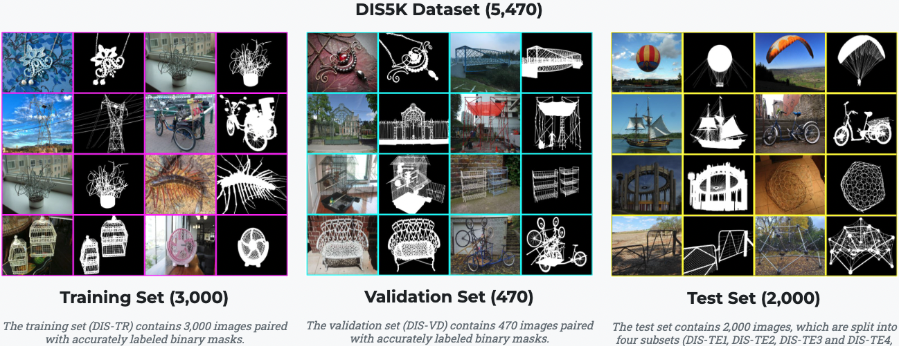
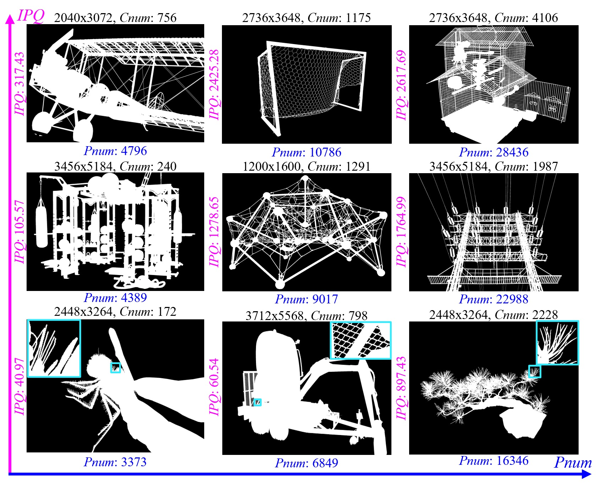
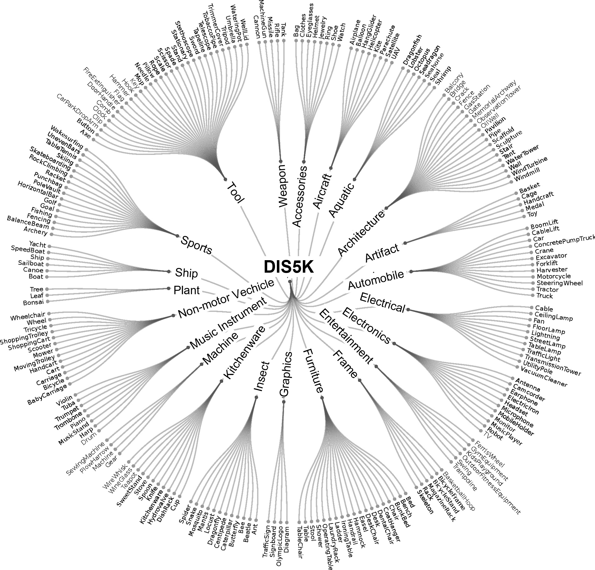
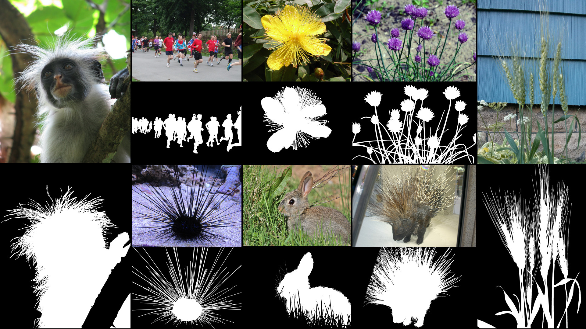
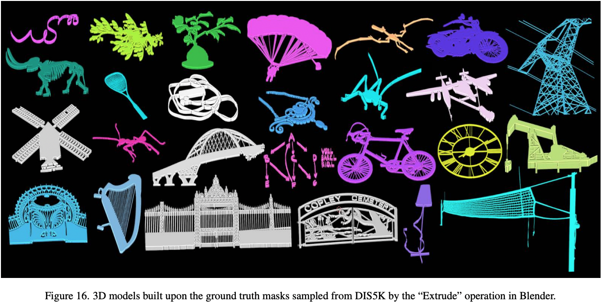
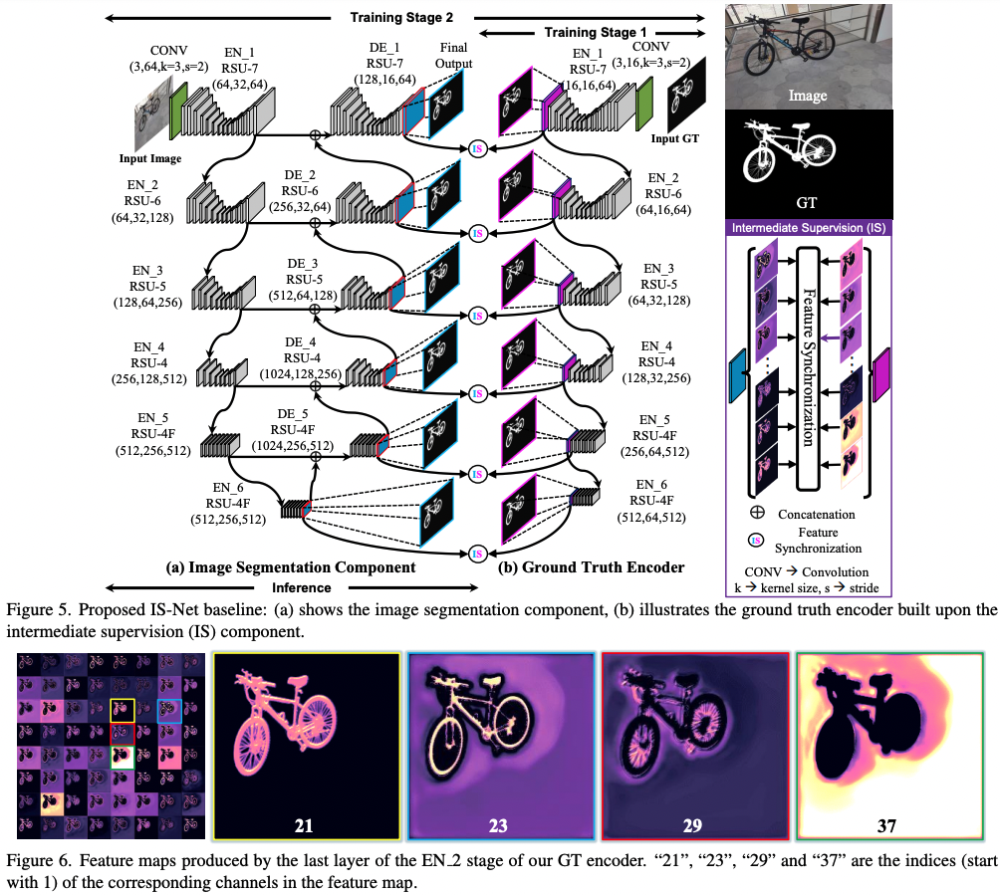
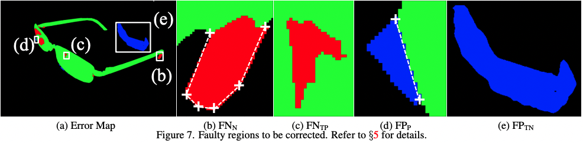
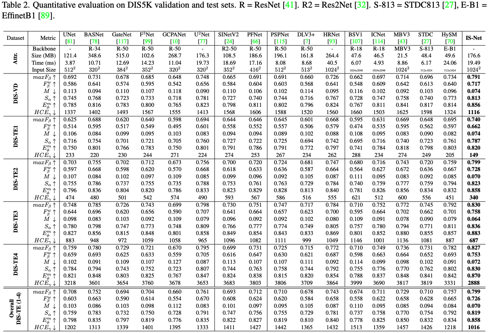

<p align="center">
  
</p>


<br> 

## [Highly Accurate Dichotomous Image Segmentation （ECCV 2022）](https://arxiv.org/pdf/2203.03041.pdf) 
[Xuebin Qin](https://xuebinqin.github.io/), [Hang Dai](https://scholar.google.co.uk/citations?user=6yvjpQQAAAAJ&hl=en), [Xiaobin Hu](https://scholar.google.de/citations?user=3lMuodUAAAAJ&hl=en), [Deng-Ping Fan*](https://dengpingfan.github.io/), [Ling Shao](https://scholar.google.com/citations?user=z84rLjoAAAAJ&hl=en), [Luc Van Gool](https://scholar.google.com/citations?user=TwMib_QAAAAJ&hl=en).

<br>

## This is the official repo for our newly formulated DIS task: 
[**Project Page**](https://xuebinqin.github.io/dis/index.html), [**Arxiv**](https://arxiv.org/pdf/2203.03041.pdf).

<br> 

## Updates !!!

<br>

## ** (2022-Jul.-17)** Our paper, code and dataset are now officially released!!! Please check our project page for more details: [**Project Page**](https://xuebinqin.github.io/dis/index.html).<br>
** (2022-Jul.-5)** Our DIS work is now accepted by ECCV 2022, the code and dataset will be released before July 17th, 2022. Please be aware of our updates. 

<br> 

## 1. Our Dichotomous Image Segmentation (DIS) Dataset

### 1.1 [DIS dataset V1.0: DIS5K](https://xuebinqin.github.io/dis/index.html) 

<br>

### Download： [Google Drive](https://drive.google.com/file/d/1jOC2zK0GowBvEt03B7dGugCRDVAoeIqq/view?usp=sharing) or [Baidu Pan 提取码：rtgw](https://pan.baidu.com/s/1y6CQJYledfYyEO0C_Gejpw?pwd=rtgw)





### 1.2 [DIS dataset V2.0](https://github.com/xuebinqin/DIS)

<br>

Although our DIS5K V1.0 includes samples from more than 200 categories, many categories, such as human, animals, cars and so on, in real world are not included. [So the current version (v1.0) of our dataset may limit the robustness of the trained models.]() To build the comprehensive and large-scale highly accurate dichotomous image segmentation dataset, we are building our DIS dataset V2.0. The V2.0 will be released soon. Please stay tuned.

Samples from DIS dataset V2.0.


<br> 

## 2. APPLICATIONS of Our DIS5K Dataset

<br>

### 3D Modeling 


### Image Editing

### Art Design Materials

### Still Image Animation

### AR 

### 3D Rendering


<br> 

## 3. Architecture of Our IS-Net

<br> 



<br>

## 4. Human Correction Efforts (HCE)

<br>



<br>

## 5. Experimental Results

<br>

### Predicted Maps, [(Google Drive)](https://drive.google.com/file/d/1FMtDLFrL6xVc41eKlLnuZWMBAErnKv0Y/view?usp=sharing), [(Baidu Pan 提取码：ph1d)](https://pan.baidu.com/s/1WUk2RYYpii2xzrvLna9Fsg?pwd=ph1d), of Our IS-Net and Other SOTAs

### Qualitative Comparisons Against SOTAs


### Quantitative Comparisons Against SOTAs


<br>

## 6. Run Our Code

<br>

### (1) Clone this repo
```
git clone https://github.com/xuebinqin/DIS.git
``` 

### (2) Configuring the environment: go to the root ```DIS``` folder and run 
```
conda env create -f pytorch18.yml
```
Or you can check the ```requirements.txt``` to configure the dependancies. 

### (3) Train:
(a) Open ```train_valid_inference_main.py```, set the path of your to-be-inferenced ```train_datasets``` and ```valid_datasets```, e.g., ```valid_datasets=[dataset_vd]``` <br>
(b) Set the ```hypar["mode"]``` to ```"train"``` <br>
(c) Create a new folder ```your_model_weights``` in the directory ```saved_models``` and set it as the ```hypar["model_path"] ="../saved_models/your_model_weights"``` and make sure ```hypar["valid_out_dir"]```(line 668) is set to ```""```, otherwise the prediction maps of the validation stage will be saved to that directory, which will slow the training speed down <br>
(d) Run 
```
python train_valid_inference_main.py
```

### (4) Inference
(a). Download the pre-trained weights (for fair academic comparisons only, the optimized model for engineering or common use will be released soon) ```isnet.pth``` from [(Google Drive)](https://drive.google.com/file/d/1KyMpRjewZdyYfxHPYcd-ZbanIXtin0Sn/view?usp=sharing) or [(Baidu Pan 提取码：xbfk)](https://pan.baidu.com/s/1-X2WutiBkWPt-oakuvZ10w?pwd=xbfk) and store ```isnet.pth``` in ```saved_models/IS-Net``` <br>
(b) Open ```train_valid_inference_main.py```, set the path of your to-be-inferenced ```valid_datasets```, e.g., ```valid_datasets=[dataset_te1, dataset_te2, dataset_te3, dataset_te4]``` <br>
(c) Set the ```hypar["mode"]``` to ```"valid"``` <br>
(d) Set the output directory of your predicted maps, e.g., ```hypar["valid_out_dir"] = "../DIS5K-Results-test"``` <br>
(e) Run 
```
python train_valid_inference_main.py
```

### (5) Use of our Human Correction Efforts(HCE) metric
Set the ground truth directory ```gt_root``` and the prediction directory ```pred_root```. To reduce the time costs for computing HCE, the skeletion of the DIS5K dataset can be pre-computed and stored in ```gt_ske_root```. If ```gt_ske_root=""```, the HCE code will compute the skeleton online which usually takes a lot for time for large size ground truth. Then, run ```python hce_metric_main.py```. Other metrics are evaluated based on the [SOCToolbox](https://github.com/mczhuge/SOCToolbox).

<br>

## 7. Term of Use
Our code and evaluation metric use Apache License 2.0. The Terms of use for our DIS5K dataset is provided as [DIS5K-Dataset-Terms-of-Use.pdf](DIS5K-Dataset-Terms-of-Use.pdf).

<br>

## Acknowledgements 

<br>

We would like to thank Dr. [Ibrahim Almakky](https://scholar.google.co.uk/citations?user=T9MTcK0AAAAJ&hl=en) for his helps in implementing the dataloader cache machanism of loading large-size training samples and Jiayi Zhu for his efforts in re-organizing our code and dataset. 

<br>

## Citation

<br>

```
@InProceedings{qin2022,
      author={Xuebin Qin and Hang Dai and Xiaobin Hu and Deng-Ping Fan and Ling Shao and Luc Van Gool},
      title={Highly Accurate Dichotomous Image Segmentation},
      booktitle={ECCV},
      year={2022}
}
```

<br>

## Our Previous Works: [U<sup>2</sup>-Net](https://github.com/xuebinqin/U-2-Net), [BASNet](https://github.com/xuebinqin/BASNet).

<br>

```

@InProceedings{Qin_2020_PR,
      title = {U2-Net: Going Deeper with Nested U-Structure for Salient Object Detection},
      author = {Qin, Xuebin and Zhang, Zichen and Huang, Chenyang and Dehghan, Masood and Zaiane, Osmar and Jagersand, Martin},
      journal = {Pattern Recognition},
      volume = {106},
      pages = {107404},
      year = {2020}
}

@InProceedings{Qin_2019_CVPR,
        author = {Qin, Xuebin and Zhang, Zichen and Huang, Chenyang and Gao, Chao and Dehghan, Masood and Jagersand, Martin},
        title = {BASNet: Boundary-Aware Salient Object Detection},
        booktitle = {The IEEE Conference on Computer Vision and Pattern Recognition (CVPR)},
        month = {June},
        year = {2019}
}

@article{qin2021boundary,
       title={Boundary-aware segmentation network for mobile and web applications},
       author={Qin, Xuebin and Fan, Deng-Ping and Huang, Chenyang and Diagne, Cyril and Zhang, Zichen and Sant'Anna, Adri{\`a} Cabeza and Suarez, Albert and Jagersand, Martin and Shao, Ling},
       journal={arXiv preprint arXiv:2101.04704},
       year={2021}
}