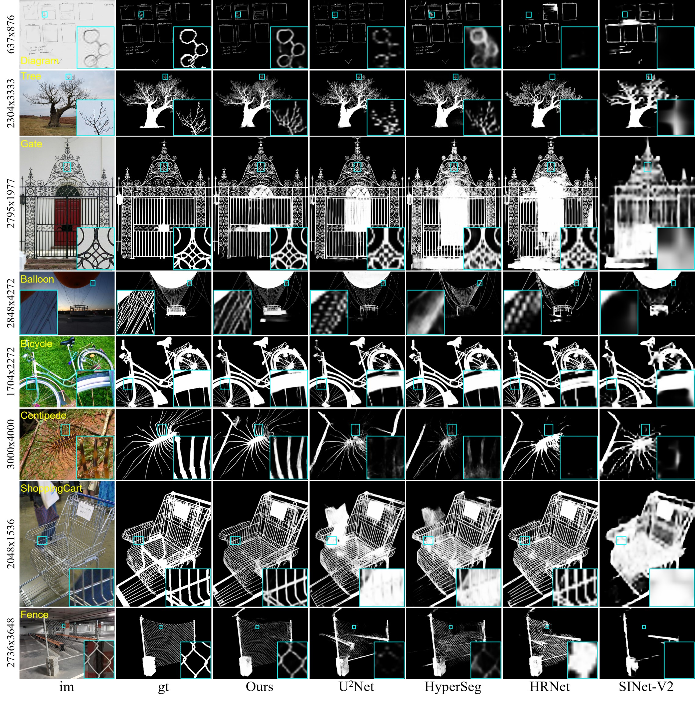

<p align="center">
  
</p>

## [Highly Accurate Dichotomous Image Segmentation （ECCV 2022）](https://arxiv.org/pdf/2203.03041.pdf) 
[Xuebin Qin](https://xuebinqin.github.io/), [Hang Dai](https://scholar.google.co.uk/citations?user=6yvjpQQAAAAJ&hl=en), [Xiaobin Hu](https://scholar.google.de/citations?user=3lMuodUAAAAJ&hl=en), [Deng-Ping Fan*](https://dengpingfan.github.io/), [Ling Shao](https://scholar.google.com/citations?user=z84rLjoAAAAJ&hl=en) and [Luc Van Gool](https://scholar.google.com/citations?user=TwMib_QAAAAJ&hl=en).


This is the official repo for our new project DIS: 
[**[Project Page]**](https://xuebinqin.github.io/dis/index.html)

## Updates !!!

** (2022-Jul.-5)** Our DIS work is now accepted by ECCV 2022, the code and dataset will be released before July 17th, 2022. Please be aware of our updates. 

## DEMO


## Comparisons Against SOTAs


## Citation
```
@InProceedings{qin2022,
      author={Xuebin Qin and Hang Dai and Xiaobin Hu and Deng-Ping Fan and Ling Shao and Luc Van Gool},
      title={Highly Accurate Dichotomous Image Segmentation},
      booktitle={ECCV},
      year={2022}
}
```
## Our Previous Works
```
@InProceedings{Qin_2020_PR,
      title = {U2-Net: Going Deeper with Nested U-Structure for Salient Object Detection},
      author = {Qin, Xuebin and Zhang, Zichen and Huang, Chenyang and Dehghan, Masood and Zaiane, Osmar and Jagersand, Martin},
      journal = {Pattern Recognition},
      volume = {106},
      pages = {107404},
      year = {2020}
}

@article{qin2021boundary,
       title={Boundary-aware segmentation network for mobile and web applications},
       author={Qin, Xuebin and Fan, Deng-Ping and Huang, Chenyang and Diagne, Cyril and Zhang, Zichen and Sant'Anna, Adri{\`a} Cabeza and Suarez, Albert and Jagersand, Martin and Shao, Ling},
       journal={arXiv preprint arXiv:2101.04704},
       year={2021}
}

@InProceedings{Qin_2019_CVPR,
        author = {Qin, Xuebin and Zhang, Zichen and Huang, Chenyang and Gao, Chao and Dehghan, Masood and Jagersand, Martin},
        title = {BASNet: Boundary-Aware Salient Object Detection},
        booktitle = {The IEEE Conference on Computer Vision and Pattern Recognition (CVPR)},
        month = {June},
        year = {2019}
}
